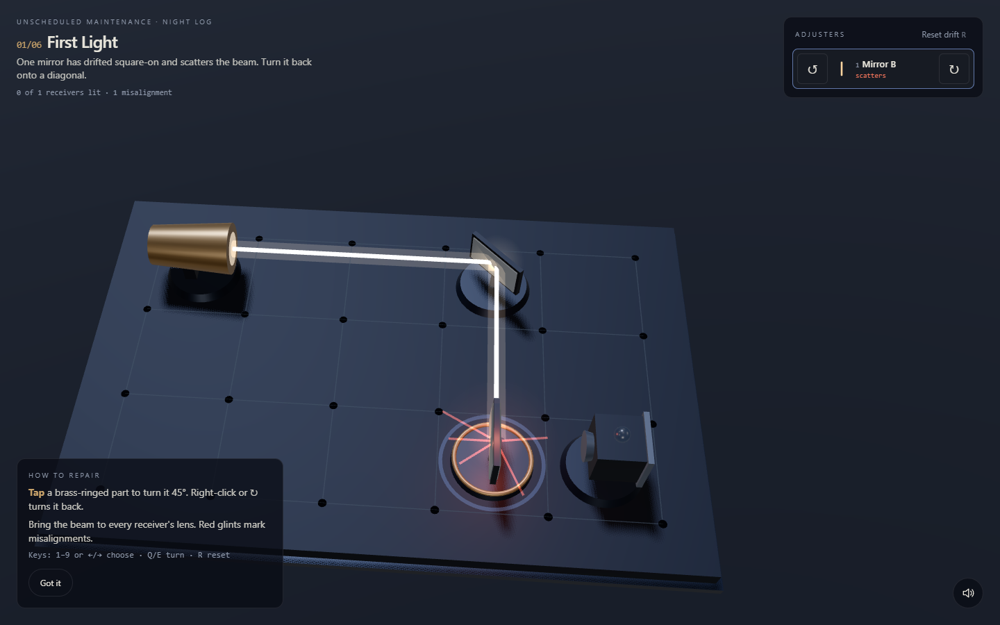
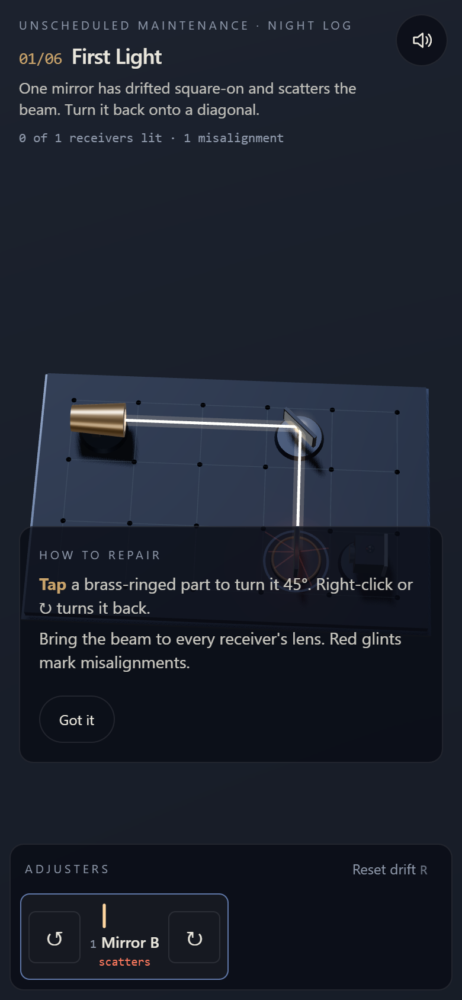

<p align="center"></p>

<p align="center">
  <a href="https://11-unscheduled-maintenance.williamking.workers.dev"></a>
  
  
  
  
  
  
</p>

**An optical-repair puzzle in a dark observatory.** The telescope's mirrors have drifted in the cold. Realign mirrors, apertures and splitters until the starlight reaches every receiver, and each repair reveals a stranger constellation through the dome slit.

<p align="center"></p>

## How to play

- **Goal:** bring the warm beam from the telescope feed (the brass barrel) into the lens of every receiver. A receiver's lamp lights when it is fed.
- **Mirrors** turn light by a right angle, but only on a diagonal. A mirror that has drifted square-on scatters the beam in a pulsing red glint.
- **Apertures** pass light along the tube, never across it.
- **Receivers** only see light entering their lens; light on the back plate is wasted.
- **Splitters** (half-silvered glass) send light straight on and turn it at the same time.
- Parts with a **brass ring** can be adjusted; the rest are locked.

| Action | Mouse / touch | Keyboard |
| --- | --- | --- |
| Turn a part 45° counter-clockwise | Click or tap it, or ↺ | `Q` |
| Turn it back | Right-click it, or ↻ | `E` |
| Choose a part | Click or tap it | `1`–`9`, `←` `→` |
| Reset the level's drift | Reset drift | `R` |
| Mute (remembered) | Speaker button | `M` |

## What's inside

- **Six authored repairs**, each ending with the camera tilting up through the dome slit to draw a new fictional constellation.
- **A discovery at the end of the night:** a constellation shaped like the telescope itself, with one star that blinks back.
- **Honest optics:** a pure beam tracer and a solver in `src/game/`, with tests, so every repair is guaranteed solvable.
- **Sound for every event:** a metal tick for mirrors, rising chimes as receivers light, a crackle for new misalignments, a dome-shutter sweep and a steel-drum discovery jingle.
- **Accessible:** every control is labelled and reachable with Tab, and reduced motion cuts straight to each result.

## Screenshots

| Desktop | Phone |
| --- | --- |
|  |  |

## Built with

Three.js for the observatory, optical bench, beams, dome and star field (all geometry and shaders made in code); React for the HUD; GSAP for the camera tilts; TypeScript throughout; Vite and Bun for the build.

- **Beam tracing as rules:** mirrors, apertures, splitters and receivers are modelled in pure TypeScript and traced each turn; the scene only draws what the tracer returns.
- **Constellations as data:** each repair unlocks an authored star pattern drawn over a procedural sky.
- **A guided night:** a camera tour of the optical bench leads into an optional, action-led guide. Select a part without turning it, restore the beam, then follow the repair into the sky. Keyboard, touch and reduced-motion routes share the same six puzzles.

## Run it locally

```sh
bun install --frozen-lockfile
bun run dev      # http://127.0.0.1:4521/
bun run check    # tsc, Biome, bun test, production build into dist/
bun run preview  # http://127.0.0.1:4621/
bun run e2e      # all six repairs, replay and two small touch layouts
```

`src/game/` holds the beam trace, levels, reducer and solver (tested in `tests/`), `src/scene/` the three.js scene, `src/ui/` the React HUD.

## Credits

Code, geometry, shaders, levels and constellations are original to this project; no third-party art or fonts. Libraries: three.js (MIT), React (MIT), GSAP (GreenSock standard licence), Tailwind CSS (MIT).

Audio, all **CC0** (https://creativecommons.org/publicdomain/zero/1.0/), transcoded to MP3:

| File | Original | Author | Source |
| --- | --- | --- | --- |
| `music.mp3` | *Observing The Star* | yd | https://opengameart.org/content/another-space-background-track |
| `hum.mp3`, `dome.mp3` | Sci-fi Sounds | Kenney | https://kenney.nl/assets/sci-fi-sounds |
| `turn-mirror.mp3` | Impact Sounds | Kenney | https://kenney.nl/assets/impact-sounds |
| `turn-tube`, `ui`, `lit`, `answer`, `scatter`, `backside`, `reset`, `solved`, `star`, `toggle` | Interface Sounds | Kenney | https://kenney.nl/assets/interface-sounds |
| `discovery.mp3` | Music Jingles (Steel 16) | Kenney | https://kenney.nl/assets/music-jingles |

Thanks to Kenney (www.kenney.nl) and yd; credit isn't required under CC0 but is given gladly.

---

<p align="center"><sub>Part of William King's portfolio collection.</sub></p>
