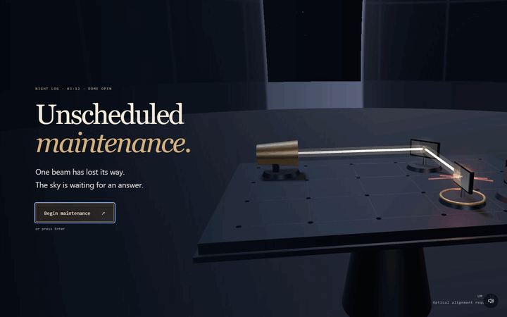
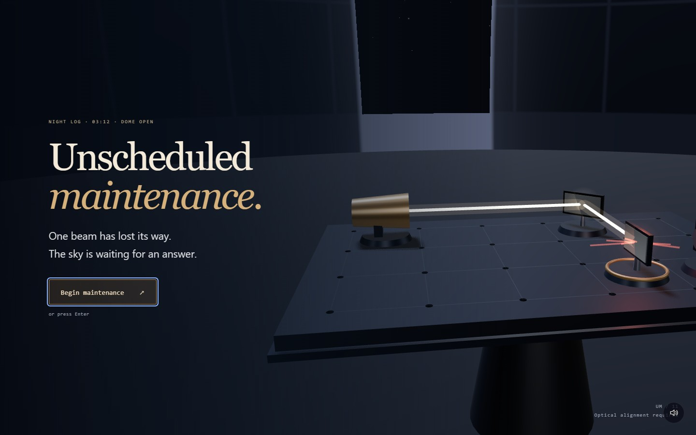
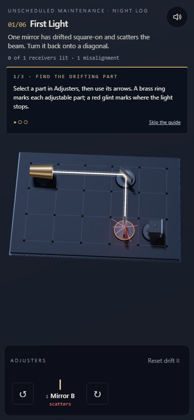
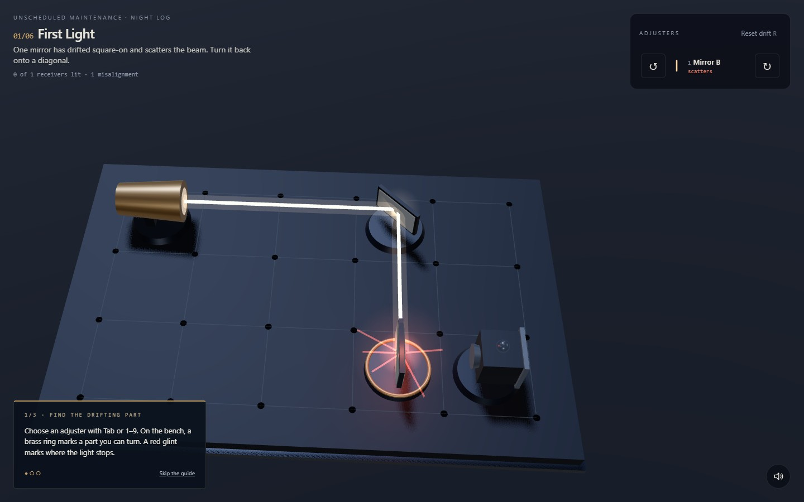

# UNSCHEDULED MAINTENANCE

<p align="center"></p>

The observatory's mirrors have drifted in the cold. Repair its optical bench until starlight reaches every receiver, then look through the dome to see what you have found. Six repairs lead to six increasingly unusual constellations.

**[Begin maintenance →](https://11-unscheduled-maintenance.williamking.workers.dev)** · [Run locally](#run-locally) · [Credits](#credits)

<p align="center"></p>

## Follow the light

**Begin maintenance** moves from the observatory title shot to the bench. The optional guide introduces selecting a part, adjusting the beam and following a completed repair into the sky. Select controls do not turn the part; the separate arrow controls let you make a deliberate adjustment.

- **Mirrors** reflect along their valid diagonal alignment. A square-on misalignment scatters the beam instead.
- **Apertures** pass light along their tubes, not across them.
- **Receivers** accept light through the lens; hitting the rear plate does not count.
- **Splitters** transmit light and reflect a branch at the same time.
- **Brass-ringed parts** can be adjusted; fixed parts constrain the route.

| Action | Keyboard | Pointer or touch |
| --- | --- | --- |
| Select a part without turning it | 1–9 or Left/Right | Select button in that part's row |
| Turn counter-clockwise / clockwise | Q / E | ↺ / ↻; scene click / right-click |
| Restore the initial drift | R | Reset drift |
| Toggle sound | M | Sound |

Light every receiver to complete a repair. The camera rises through the dome slit and draws the resulting constellation, then the next repair begins. The final discovery closes the night and offers replay.

## One optical model

A pure beam tracer models reflections, apertures, splitters and receiver orientation. The Three.js scene draws the trace returned by those rules. A solver checks the authored puzzles rather than relying on a plausible-looking beam. Reset, angle wrapping and interrupted sky reveals have explicit state transitions.

The phone layout measures the space left by the header and adjustment panel before framing the bench. Native controls provide keyboard focus and selection, and reduced motion settles camera changes without making the player wait through the reveal. Procedural geometry, a star field and CC0 sound form the observatory's presentation.

## Verification and source

Application revision `9dae8bd` passed **67 tests / 552 assertions**, an independent check of **1,252 arrangements** and three RTX 2060 browser scenarios covering all six repairs, reset, ending/replay and two touch layouts. See the [intro and audit report](docs/visual/INTRO-2026-09-30.md).

[src/game/](src/game/) contains optics, levels, state and solver; [src/scene/](src/scene/) contains the bench and sky; [src/ui/](src/ui/) contains adjustment controls and result cards; [src/audio/](src/audio/) contains sound.

## Current screenshots

| Desktop | Phone |
| --- | --- |
|  |  |



The opening loop and three main screenshots were captured from the live site on **1 October 2026**, using Chrome on this workstation; the phone image is a 390 × 844 browser viewport. The animated preview is a short loop, not a full playthrough. [Capture details](docs/readme/capture.json).

## Run locally

Use **Bun 1.3.10** (the version pinned in `package.json`) and Node.js 22.12 or newer. From this repository:

```sh
bun install --frozen-lockfile
bun run dev      # http://127.0.0.1:4521/
bun run check    # strict types, Biome, unit tests and production build
bun run preview  # http://127.0.0.1:4621/ after the build
```

Development and preview are separate long-running commands; run one at a time or use separate terminals. `bun run build` writes the static production output to `dist/`. Dependencies and the lockfile are local to this project.

### Browser suite

Install the test browser once, then run the checked-in Playwright suite. Its configuration builds and starts the production preview. Browser scenarios are separate from `bun run check`.

```sh
bunx playwright install chromium
bun run e2e
```

The recorded real-GPU release checks used installed Chrome on an RTX 2060; the default Chromium configuration is not a claim of physical-phone coverage.

## Stack and release

Direct Three.js 0.186 · React 19.3 · strict TypeScript · Vite 8.3 · GSAP 3.15 · Tailwind CSS 4.3 · Bun 1.3.10 · Biome. The public website is served by Cloudflare Workers. This README describes [application revision 9dae8bd](https://github.com/WilliamHenryKing/11-unscheduled-maintenance/commit/9dae8bd47d0f76dc70ce2670871463f20a99b1f6); the documentation refresh changes no application behaviour.

## Credits

Code, geometry, shaders, levels and constellations are original to this project; no third-party art or fonts. Libraries: three.js (MIT), React (MIT), GSAP (GreenSock standard licence), Tailwind CSS (MIT).

Audio, all **CC0** ([CC0 licence](https://creativecommons.org/publicdomain/zero/1.0/)), transcoded to MP3:

| File | Original | Author | Source |
| --- | --- | --- | --- |
| `music.mp3` | *Observing The Star* | yd | [Source](https://opengameart.org/content/another-space-background-track) |
| `hum.mp3`, `dome.mp3` | Sci-fi Sounds | Kenney | [Source](https://kenney.nl/assets/sci-fi-sounds) |
| `turn-mirror.mp3` | Impact Sounds | Kenney | [Source](https://kenney.nl/assets/impact-sounds) |
| `turn-tube`, `ui`, `lit`, `answer`, `scatter`, `backside`, `reset`, `solved`, `star`, `toggle` | Interface Sounds | Kenney | [Source](https://kenney.nl/assets/interface-sounds) |
| `discovery.mp3` | Music Jingles (Steel 16) | Kenney | [Source](https://kenney.nl/assets/music-jingles) |

Thanks to Kenney (www.kenney.nl) and yd; credit isn't required under CC0 but is given gladly.

---

Part of [William King's portfolio collection](https://github.com/WilliamHenryKing).
